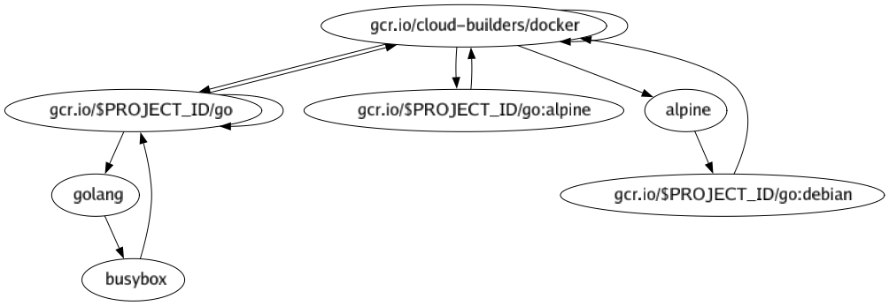

# Google Cloud Build Pipeline Visualizer

[](https://github.com/RyanSiu1995/gcb-visualizer/workflows/Go/badge.svg) [](https://codecov.io/gh/RyanSiu1995/gcb-visualizer)

For the current version of Google cloud build, it supports the async process with the variable `waitFor`. With the growth of complexity of your pipeline, it will be hard to maintain the async flow. Unlike Jenkins and CircleCI, there is no visualizer for your pipeline. This application aims at visualize the pipeline and help the developers to debug their cloud build.

## Current features
* YAML format cloud build definition digestion
* Temporary graph rendering
* Save graph as dot, png, jpg or jpeg
* JSON format support

## Rule of cloud build async process
From the Google [docs](https://cloud.google.com/cloud-build/docs/configuring-builds/configure-build-step-order), there are a few rules for the async process.
1. If no values are provided for waitFor, the build step waits for all prior build steps in the build request to complete successfully before running.
1. A step is dependent on every id in its waitFor and will not launch until each dependency has completed successfully.
1. By declaring that a step depends only on `-`, the step runs immediately when the build starts.

## How to install
1. Through `go get` (Recommended)

   You can install the binary through the following command.
   ```bash
   go get -u github.com/RyanSiu1995/gcb-visualizer
   ```
1. Install the pre-built binary

   You can download the pre-built binary in [release page](https://github.com/RyanSiu1995/gcb-visualizer/releases) of this repo. Because of the C binding in the Graphviz library, there is a difficulty in building binary based on different common OS and Arch. The current pre-built binaries are built under 64 bit. If you are an user with 32 bits system, please use other approach. If the pre-built binary does not work. Please report on the issue.
1. Use pre-built docker image

   You can use docker image released to execute the gcb-visualizer without considering the OS and Arch. Please follow this instruction to setup the command alias.
   ```bash
   docker pull ryansiu1995/gcb-visualizer:latest
   alias gcb-visualizer="docker run -v $(pwd):/app ryansiu1995/gcb-visualizer:latest"
   ```
   or this command in powershell
   ```powershell
   docker pull ryansiu1995/gcb-visualizer:latest
   Set-Alias gcb-visualizer "docker run -v $(pwd):/app ryansiu1995/gcb-visualizer:latest"
   ```
   You can put the alias to your profile in order to create a permanent alias.

## How to use
You can visualize your pipeline with the following command.
```bash
gcb-visualizer visualize <your-cloudbuild-yaml-or-json-file>
```
If you want to output the graph into other formats, you can use the output flag as the following.
```bash
gcb-visualizer visualize --output my-pipeline.jpg <your-cloudbuild-yaml>
```
The current supported output formats are jpg, jpeg, dot and png.

## Example Output
Given an example input of something like the [Google Cloud integration test example](https://github.com/GoogleCloudPlatform/cloudbuild-integration-testing/blob/master/cloudbuild.compose.yaml)
you should get an output that looks something like this



## Future features
* Cloudbuild definition linting and checking
* Multiple OS and Arch binary building
* Brew, Apt and Chocolatey support
* Quick installation script
* More beautiful generated graph

## Contributing
Please feel free to submit a pull request or open an issue for the application improvement. Before creating the pull request, please kindly run the follow command to test the program
```bash
make tests
```

## License
This project is licensed under the MIT License - see the [LICENSE.md](./LICENSE.md) file for details
